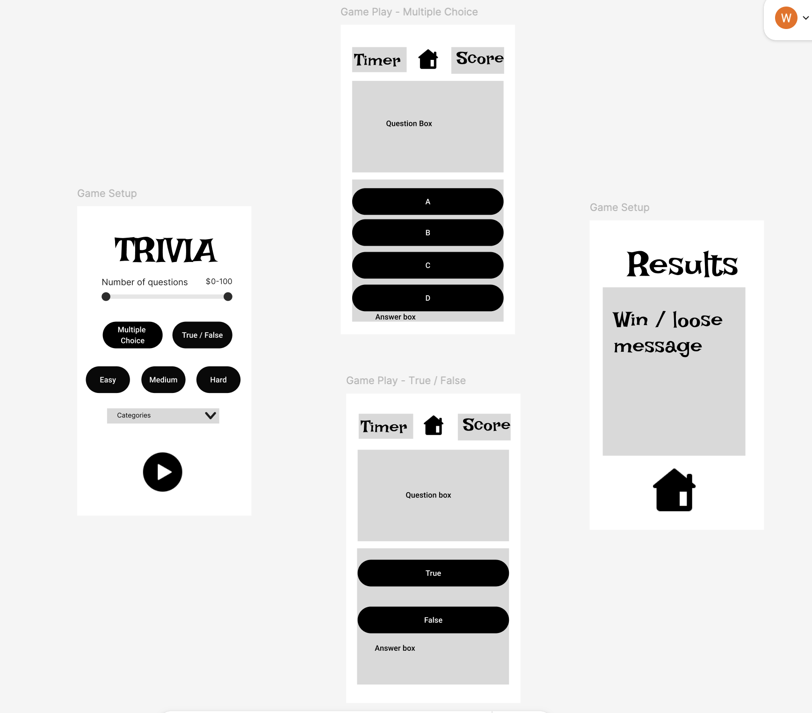

# Trivia game with API

## TABLE OF CONTENTS
  - [Objectives](#objectives)
  - [Prerequisites](#prerequisites)
  - [How to run the game](#run)
  - [User Stories](#user-stories)
  - [Wireframes](#wireframe)
  - [Things I tested](#test)
## OBJECTIVES <a name="objectives"></a>
This is a trivia game that utilizes an api
## Prerequisites <a name="prerequesites"></a>
- [ ] vite
- [ ] express
- [ ] api
## How to run the game <a name="run"></a>
1. Clone this project  
` git clone https://github.com/wk642/trivia-game-with-api.git`  
2. In your terminal:  
` cd trivia-game-with-api`
3. Install the following  
    ```
    cd server
    npm install express cors node-fetch nodemon
    ```
    ```
    cd ../client
    npm install
    ```
    To run the game  
    ` npm run dev`   
To run tests:   
` npm install --save-dev jest`
## User Stories <a name="user-stories"></a>
```
MVP User story #1
  as a user,

  when I visit "/setup/"

  I will fill out the form 
    and click submit

  then game starts
```
```
MVP User sotry #2
  as a user, 

  when I visit setup 
    and fill out the form
    and click submit 
    and the game starts 

  then I will visit "/game/"
    and select an answer
   
  then I will click on next question button
```
```
MVP User sotry #3
  as a user,

  when I complete game setup
  and I answered all questions

  then I wil see the win / loose message 
```

```
Optional User story #1 
  elmiinate next question button in user story #2
  replace with progress bar / timer
```
``` 
Optional User story #2
  Allow user to exit out of the game before answering all questions
```
```
Optional User story #3 
  Have a restart option for same settings
  different settings
```

## Wireframe <a name="wireframe"></a>
For mobile:  

## Things to test for <a name="test"></a>
- [ ] Does it actually require all the settings to be selected before game start
- [ ] is it checking for the correct answer
- [ ] is it updating the score
- [ ] is it dispalying the correct score
- [ ] is it displaying the correct righ / wrong message
- [ ] is it displaying the correct final message

  Edge Cases
  - [ ] What if user did not select all the settings